# 技术报告

赛题三:考虑逻辑复制的超图分割算法设计
队伍id:eda240317

## 一、自测报告

我们的项目结构如下：

```shell
.
├── CMakeLists.txt
├── README.md
├── build
│   ├── partitioner
│   ├── output.log
│   └── other_build_files
├── evaluator
│   └── evaluator
├── testcase
│   ├── case01
│   ├── case02
│   ├── case03
│   └── case04
├── hypar.hpp
├── main.cpp
├── hypar.cpp
├── coarsen.cpp
├── initialpar.cpp
├── refine.cpp
└── other_files
```

### 自测脚本

我们在项目根目录下编写了一个自测脚本 `test.sh`，用于自动化地构建项目、运行分区器和评估器，并将输出结果保存到 `build/output.log` 文件中。脚本内容如下：

```shell
#!/bin/bash

# 检查是否没有参数传入
if [ $# -ne 0 ]; then
    echo "Usage: $0 (no arguments needed)"
    exit 1
fi

# 开始构建过程
set -e  # 如果任何命令失败，脚本立即退出

# 创建构建目录并编译项目
mkdir -p build
cd build
cmake ../
make

if [ $? -eq 0 ]; then
    echo "Build succeeded."
else
    echo "Build failed."
    exit 1
fi

cd ..  # 返回到项目根目录

# 清空输出日志文件
> ./build/output.log

# 遍历测试案例 case01 到 case04
for CASE in case01 case02 case03 case04; do
    echo "Running test for $CASE..." >> ./build/output.log

    # 记录 partitioner 的执行时间并将其输出到 output.log
    { time ./build/partitioner -t "testcase/${CASE}" -s "testcase/${CASE}/design.fpga.out"; } 2>&1 | \
    tee -a ./build/output.log | \
    grep real | \
    sed "s/^/Partitioner time for $CASE: /" >> ./build/output.log

    if [ $? -eq 0 ]; then
        echo "Partitioner test for $CASE succeeded." >> ./build/output.log
        echo "Running evaluator for $CASE..." >> ./build/output.log

        # 运行 evaluator 并将输出附加到 output.log
        ./evaluator/evaluator -t "testcase/${CASE}" -s "testcase/${CASE}/design.fpga.out" >> ./build/output.log
    else
        echo "Partitioner test for $CASE failed." >> ./build/output.log
    fi
done

echo "All tests completed."
```

### 自测结果

我们在服务器home目录的环境下运行了自测脚本，并将输出结果保存到 `build/output.log` 文件中。 `output.log` 文件的原始输出放到了文末，将输出结果进行整理，得到如下表格：

| Case | Partitioner Time | Evaluator Result | Total Hop Length |
| ---- | ---------------- | ---------------- | ---------------- |
| case01 | 0m0.469s | Success | 11 |
| case02 | 1m13.803s | Success | 3766 | 
| case03 | 1m21.393s | Success | 14632 |
| case04 | 6m27.863s | Success | 366884 |

## 二、算法介绍

我们的程序使用了一个multi-level的超图分割算法，主要分为三个步骤：初始分割、粗化和细化，以及最后的逻辑复制。

### 1. 算法流程

算法流程图如下:



1. Coarsen: 通过合并节点来减小超图的规模，得到一个粗化的超图。
2. Initial Partition: 对粗化的超图进行初始分割。
3. Refine: 对初始分割的结果进行细化。
4. Logic Replication: 进行逻辑复制。

### 2. 核心算法介绍

#### 2.1 Coarsen

遍历网表，对于足够小的网表，计算其中节点两两之间的分数，维护一个分数的unordered_map，然后根据分数对节点进行排序，按照分数从高到底的顺序合并可以合并的节点，合并后的节点的权重为原来节点的权重之和，合并后的节点的边为原来节点的边的并集。
重复这个过程直到网表的规模小于一个阈值。

#### 2.2 Initial Partition

先用一个简单的size-constrained label propagation (SCLaP)算法对粗化后的超图进行初始分割，然后对分割结果进行贪心的细化(Greedy Hypergraph Growth)，细化的目标是减小外部切割。最后检查分割结果是否合法，如果不合法则将所有超过max hop限制的节点极其邻居激活(activate)，对他们进行一次贪心的细化。

#### 2.3 Refine

逐步解除一对或多对节点的合并，激活一部分节点，然后对其进行贪心的细化，直到不能再减小总hop长度为止。

#### 2.4 Logic Replication

计算每个网表可以复制去的FPGA，然后按照一定顺序复制节点，直到不能找到合法的可以复制的FPGA为止。

### 3. 创新点介绍

#### 3.1 动态适应输入的规模

我们的算法针对不同规模的输入进行了动态调整，以充分利用多核CPU的计算资源，提高算法的效率，充分权衡效率和质量，实现了以下几个方面的动态调整：

1. 线程数：根据输入的规模动态调整线程数，以充分利用多核CPU的计算资源，在较小规模的情况下会循环使用线程取最优结果。
2. 超图粗化：根据输入的规模动态调整超图粗化的阈值，以充分利用超图粗化的优势，在极小规模的情况下不进行粗化。
3. 初始分割：根据输入的规模动态调整初始分割的参数，在极小规模的情况下多次分割取最优结果。
4. 细化：细分了三种refine的策略，分别是完整的refine，fast_refine和only_fast_refine，根据输入的规模动态选择策略。
5. 逻辑复制：采用了三种选择顺序的策略，分别是遍历网表(traverse)，随机选择(random)和维护全局最大堆(priority queue)，多样化的策略可以适应不同的输入。

#### 3.2 自动合法化分割

我们的算法能够快速得到合法的分割结果，这是因为在具体的实现中，我们在每一步都会注意使得各种限制条件的满足情况不劣于上一步，这样就能够保证最终的结果是合法的，并且不会陷入死循环。

1. 在初始分割的时候，我们会限制每个节点可以被分配到的FPGA，防止出现超越FPGA资源限制和超越max hop限制的情况。
2. 由于是顺序的逐步分割，因此初步分割后可能会出现max hop超过限制的情况，因此我们会随后激活超过限制的节点，然后进行一次贪心的细化。
3. 在后续的细化过程中，我们也会限制每个节点可以被移向的FPGA，防止限制条件的满足情况劣化。
4. 在逻辑复制的过程中，我们会根据每个节点的剩余资源和max hop限制，选择合适的FPGA进行复制，以保证最终的结果是合法的。

#### 3.3 多样化的打分策略

在编写程序的过程中，我们设计了多样化的打分策略，并且逐一测试他们的组合效果，最终选择了结果最优且运行最稳定的组合。
我们在初始分割的贪心细化过程中，采取了FM gain作为打分策略，而在后续的激活节点和细化过程中采用了hop gain作为打分策略，这样可以保证在不同的阶段都能够得到合适的结果。
因为在multi-level的超图分割算法中，分割的大体性质是由初始分割决定的，而细化的过程则是对初始分割的修正，因此我们在初始分割的时候采用FM gain不仅可以减少超出FPGA连通数限制的情况，还可以减少外部切割，而在后续的细化过程中，我们采用hop gain作为打分策略，可以快速直观地减少总hop长度。

## 附: 自测原始输出

```shell
Running test for case01...

real	0m0.469s
user	0m1.053s
sys	0m0.047s
Partitioner time for case01: real	0m0.469s
Partitioner test for case01 succeeded.
Running evaluator for case01...
Reading FPGA......
Input FPGA Finished: 4
Reading Node......
Input Node Finished: 16
Reading Net......
Input Net Finished: 13
Reading Solution......
Input Topo Finished: 3
Reading FPGA......
Input Solution Finished: 17
----------------------------
Resources of FPGA1: [ 4 29 12 0 0 0 0 0 ]
Resources of FPGA2: [ 6 40 11 0 0 0 0 0 ]
Resources of FPGA3: [ 6 40 9 0 0 0 0 0 ]
Resources of FPGA4: [ 1 15 0 0 0 0 0 0 ]
Total extern cut of FPGA1: 6
Total extern cut of FPGA2: 8
Total extern cut of FPGA3: 4
Total extern cut of FPGA4: 1

Congratulations! Solution is legal.
----------------------------
Total Hop Length = 11
----------------------------
Running test for case02...

real	1m13.803s
user	3m33.746s
sys	0m0.097s
Partitioner time for case02: real	1m13.803s
Partitioner test for case02 succeeded.
Running evaluator for case02...
Reading FPGA......
Input FPGA Finished: 8
Reading Node......
Input Node Finished: 600
Reading Net......
Input Net Finished: 1239
Reading Solution......
Input Topo Finished: 11
Reading FPGA......
Input Solution Finished: 676
----------------------------
Resources of FPGA1: [ 748 174 145 145 188 140 194 140 ]
Resources of FPGA2: [ 716 237 150 174 179 198 235 230 ]
Resources of FPGA3: [ 748 258 231 220 207 214 240 230 ]
Resources of FPGA4: [ 57 139 92 94 78 116 67 133 ]
Resources of FPGA5: [ 377 50 62 57 49 37 31 59 ]
Resources of FPGA6: [ 615 55 35 46 31 39 41 58 ]
Resources of FPGA7: [ 731 103 106 84 100 111 117 155 ]
Resources of FPGA8: [ 739 125 100 99 103 98 110 113 ]
Total extern cut of FPGA1: 585
Total extern cut of FPGA2: 824
Total extern cut of FPGA3: 606
Total extern cut of FPGA4: 15
Total extern cut of FPGA5: 203
Total extern cut of FPGA6: 544
Total extern cut of FPGA7: 784
Total extern cut of FPGA8: 524

Congratulations! Solution is legal.
----------------------------
Total Hop Length = 3766
----------------------------
Running test for case03...

real	1m21.393s
user	5m0.228s
sys	0m1.474s
Partitioner time for case03: real	1m21.393s
Partitioner test for case03 succeeded.
Running evaluator for case03...
Reading FPGA......
Input FPGA Finished: 32
Reading Node......
Input Node Finished: 11451
Reading Net......
Input Net Finished: 31071
Reading Solution......
Input Topo Finished: 88
Reading FPGA......
Input Solution Finished: 14516
----------------------------
Resources of FPGA1: [ 4611 504 0 0 0 0 0 0 ]
Resources of FPGA2: [ 4579 413 0 0 0 0 0 0 ]
Resources of FPGA3: [ 3550 449 0 0 0 0 0 0 ]
Resources of FPGA4: [ 3925 428 0 0 0 0 0 0 ]
Resources of FPGA5: [ 4611 350 0 0 0 0 0 0 ]
Resources of FPGA6: [ 4080 471 0 0 0 0 0 0 ]
Resources of FPGA7: [ 3590 405 0 0 0 0 0 0 ]
Resources of FPGA8: [ 3615 465 0 0 0 0 0 0 ]
Resources of FPGA9: [ 4233 482 0 0 0 0 0 0 ]
Resources of FPGA10: [ 3666 345 0 0 0 0 0 0 ]
Resources of FPGA11: [ 3707 516 0 0 0 0 0 0 ]
Resources of FPGA12: [ 4611 413 0 0 0 0 0 0 ]
Resources of FPGA13: [ 4468 453 0 0 0 0 0 0 ]
Resources of FPGA14: [ 3967 453 0 0 0 0 0 0 ]
Resources of FPGA15: [ 4004 496 0 0 0 0 0 0 ]
Resources of FPGA16: [ 3981 399 0 0 0 0 0 0 ]
Resources of FPGA17: [ 2640 284 0 0 0 0 0 0 ]
Resources of FPGA18: [ 2592 320 0 0 0 0 0 0 ]
Resources of FPGA19: [ 3 4 0 0 0 0 0 0 ]
Resources of FPGA20: [ 3954 445 0 0 0 0 0 0 ]
Resources of FPGA21: [ 4537 559 0 0 0 0 0 0 ]
Resources of FPGA22: [ 4232 531 0 0 0 0 0 0 ]
Resources of FPGA23: [ 1 0 0 0 0 0 0 0 ]
Resources of FPGA24: [ 4433 537 0 0 0 0 0 0 ]
Resources of FPGA25: [ 3568 391 0 0 0 0 0 0 ]
Resources of FPGA26: [ 3855 452 0 0 0 0 0 0 ]
Resources of FPGA27: [ 4611 465 0 0 0 0 0 0 ]
Resources of FPGA28: [ 4199 399 0 0 0 0 0 0 ]
Resources of FPGA29: [ 1170 163 0 0 0 0 0 0 ]
Resources of FPGA30: [ 3886 431 0 0 0 0 0 0 ]
Resources of FPGA31: [ 3665 445 0 0 0 0 0 0 ]
Resources of FPGA32: [ 2747 301 0 0 0 0 0 0 ]
Total extern cut of FPGA1: 867
Total extern cut of FPGA2: 755
Total extern cut of FPGA3: 336
Total extern cut of FPGA4: 484
Total extern cut of FPGA5: 413
Total extern cut of FPGA6: 383
Total extern cut of FPGA7: 449
Total extern cut of FPGA8: 474
Total extern cut of FPGA9: 610
Total extern cut of FPGA10: 426
Total extern cut of FPGA11: 219
Total extern cut of FPGA12: 824
Total extern cut of FPGA13: 751
Total extern cut of FPGA14: 668
Total extern cut of FPGA15: 507
Total extern cut of FPGA16: 369
Total extern cut of FPGA17: 114
Total extern cut of FPGA18: 115
Total extern cut of FPGA19: 3
Total extern cut of FPGA20: 198
Total extern cut of FPGA21: 287
Total extern cut of FPGA22: 594
Total extern cut of FPGA23: 1
Total extern cut of FPGA24: 541
Total extern cut of FPGA25: 883
Total extern cut of FPGA26: 92
Total extern cut of FPGA27: 689
Total extern cut of FPGA28: 419
Total extern cut of FPGA29: 126
Total extern cut of FPGA30: 460
Total extern cut of FPGA31: 202
Total extern cut of FPGA32: 223

Congratulations! Solution is legal.
----------------------------
Total Hop Length = 14632
----------------------------
Running test for case04...

real	6m27.863s
user	11m18.754s
sys	0m37.368s
Partitioner time for case04: real	6m27.863s
Partitioner test for case04 succeeded.
Running evaluator for case04...
Reading FPGA......
Input FPGA Finished: 64
Reading Node......
Input Node Finished: 1000000
Reading Net......
Input Net Finished: 953817
Reading Solution......
Input Topo Finished: 173
Reading FPGA......
Input Solution Finished: 1054079
----------------------------
Resources of FPGA1: [ 16846 12951 0 0 0 0 0 0 ]
Resources of FPGA2: [ 20344 15709 0 0 0 0 0 0 ]
Resources of FPGA3: [ 20909 15839 0 0 0 0 0 0 ]
Resources of FPGA4: [ 20189 15748 0 0 0 0 0 0 ]
Resources of FPGA5: [ 20165 15613 0 0 0 0 0 0 ]
Resources of FPGA6: [ 15752 11926 0 0 0 0 0 0 ]
Resources of FPGA7: [ 20785 15474 0 0 0 0 0 0 ]
Resources of FPGA8: [ 21251 15915 0 0 0 0 0 0 ]
Resources of FPGA9: [ 17760 13476 0 0 0 0 0 0 ]
Resources of FPGA10: [ 20944 15683 0 0 0 0 0 0 ]
Resources of FPGA11: [ 21182 15789 0 0 0 0 0 0 ]
Resources of FPGA12: [ 19388 14871 0 0 0 0 0 0 ]
Resources of FPGA13: [ 20869 15805 0 0 0 0 0 0 ]
Resources of FPGA14: [ 22600 17138 0 0 0 0 0 0 ]
Resources of FPGA15: [ 11539 8642 0 0 0 0 0 0 ]
Resources of FPGA16: [ 20094 14726 0 0 0 0 0 0 ]
Resources of FPGA17: [ 19722 15144 0 0 0 0 0 0 ]
Resources of FPGA18: [ 22600 17894 0 0 0 0 0 0 ]
Resources of FPGA19: [ 17983 13630 0 0 0 0 0 0 ]
Resources of FPGA20: [ 17571 13701 0 0 0 0 0 0 ]
Resources of FPGA21: [ 20787 15786 0 0 0 0 0 0 ]
Resources of FPGA22: [ 11719 9039 0 0 0 0 0 0 ]
Resources of FPGA23: [ 22600 17360 0 0 0 0 0 0 ]
Resources of FPGA24: [ 11927 8848 0 0 0 0 0 0 ]
Resources of FPGA25: [ 20194 15864 0 0 0 0 0 0 ]
Resources of FPGA26: [ 20798 15861 0 0 0 0 0 0 ]
Resources of FPGA27: [ 20831 15840 0 0 0 0 0 0 ]
Resources of FPGA28: [ 20585 16122 0 0 0 0 0 0 ]
Resources of FPGA29: [ 16616 12859 0 0 0 0 0 0 ]
Resources of FPGA30: [ 11447 8605 0 0 0 0 0 0 ]
Resources of FPGA31: [ 15292 12112 0 0 0 0 0 0 ]
Resources of FPGA32: [ 17920 13564 0 0 0 0 0 0 ]
Resources of FPGA33: [ 16135 12220 0 0 0 0 0 0 ]
Resources of FPGA34: [ 18953 14301 0 0 0 0 0 0 ]
Resources of FPGA35: [ 20236 15300 0 0 0 0 0 0 ]
Resources of FPGA36: [ 20926 15778 0 0 0 0 0 0 ]
Resources of FPGA37: [ 19829 15473 0 0 0 0 0 0 ]
Resources of FPGA38: [ 20876 15785 0 0 0 0 0 0 ]
Resources of FPGA39: [ 19542 14919 0 0 0 0 0 0 ]
Resources of FPGA40: [ 11429 8934 0 0 0 0 0 0 ]
Resources of FPGA41: [ 19431 15024 0 0 0 0 0 0 ]
Resources of FPGA42: [ 18740 14448 0 0 0 0 0 0 ]
Resources of FPGA43: [ 19161 14483 0 0 0 0 0 0 ]
Resources of FPGA44: [ 21170 15814 0 0 0 0 0 0 ]
Resources of FPGA45: [ 20950 15897 0 0 0 0 0 0 ]
Resources of FPGA46: [ 20889 15869 0 0 0 0 0 0 ]
Resources of FPGA47: [ 11424 8775 0 0 0 0 0 0 ]
Resources of FPGA48: [ 20181 15425 0 0 0 0 0 0 ]
Resources of FPGA49: [ 16912 13244 0 0 0 0 0 0 ]
Resources of FPGA50: [ 20718 16208 0 0 0 0 0 0 ]
Resources of FPGA51: [ 10575 7795 0 0 0 0 0 0 ]
Resources of FPGA52: [ 11049 8671 0 0 0 0 0 0 ]
Resources of FPGA53: [ 20868 16162 0 0 0 0 0 0 ]
Resources of FPGA54: [ 7602 5830 0 0 0 0 0 0 ]
Resources of FPGA55: [ 11234 8776 0 0 0 0 0 0 ]
Resources of FPGA56: [ 21180 16403 0 0 0 0 0 0 ]
Resources of FPGA57: [ 20284 15691 0 0 0 0 0 0 ]
Resources of FPGA58: [ 20823 16376 0 0 0 0 0 0 ]
Resources of FPGA59: [ 10767 8319 0 0 0 0 0 0 ]
Resources of FPGA60: [ 2331 1593 0 0 0 0 0 0 ]
Resources of FPGA61: [ 21275 16381 0 0 0 0 0 0 ]
Resources of FPGA62: [ 10986 8361 0 0 0 0 0 0 ]
Resources of FPGA63: [ 22600 17359 0 0 0 0 0 0 ]
Resources of FPGA64: [ 22600 17235 0 0 0 0 0 0 ]
Total extern cut of FPGA1: 4387
Total extern cut of FPGA2: 4503
Total extern cut of FPGA3: 4794
Total extern cut of FPGA4: 4330
Total extern cut of FPGA5: 4072
Total extern cut of FPGA6: 3423
Total extern cut of FPGA7: 5408
Total extern cut of FPGA8: 4931
Total extern cut of FPGA9: 3601
Total extern cut of FPGA10: 4777
Total extern cut of FPGA11: 4971
Total extern cut of FPGA12: 5355
Total extern cut of FPGA13: 4680
Total extern cut of FPGA14: 4062
Total extern cut of FPGA15: 3263
Total extern cut of FPGA16: 3393
Total extern cut of FPGA17: 4648
Total extern cut of FPGA18: 6762
Total extern cut of FPGA19: 4348
Total extern cut of FPGA20: 5774
Total extern cut of FPGA21: 5344
Total extern cut of FPGA22: 3340
Total extern cut of FPGA23: 7253
Total extern cut of FPGA24: 3365
Total extern cut of FPGA25: 4018
Total extern cut of FPGA26: 4847
Total extern cut of FPGA27: 4901
Total extern cut of FPGA28: 5169
Total extern cut of FPGA29: 4293
Total extern cut of FPGA30: 2791
Total extern cut of FPGA31: 5566
Total extern cut of FPGA32: 3351
Total extern cut of FPGA33: 3428
Total extern cut of FPGA34: 5264
Total extern cut of FPGA35: 3010
Total extern cut of FPGA36: 4831
Total extern cut of FPGA37: 5072
Total extern cut of FPGA38: 6052
Total extern cut of FPGA39: 3821
Total extern cut of FPGA40: 3235
Total extern cut of FPGA41: 4257
Total extern cut of FPGA42: 3606
Total extern cut of FPGA43: 4563
Total extern cut of FPGA44: 4867
Total extern cut of FPGA45: 5185
Total extern cut of FPGA46: 4434
Total extern cut of FPGA47: 3150
Total extern cut of FPGA48: 3266
Total extern cut of FPGA49: 3929
Total extern cut of FPGA50: 4525
Total extern cut of FPGA51: 1712
Total extern cut of FPGA52: 2508
Total extern cut of FPGA53: 5172
Total extern cut of FPGA54: 1764
Total extern cut of FPGA55: 2308
Total extern cut of FPGA56: 5137
Total extern cut of FPGA57: 4371
Total extern cut of FPGA58: 4793
Total extern cut of FPGA59: 2532
Total extern cut of FPGA60: 647
Total extern cut of FPGA61: 6502
Total extern cut of FPGA62: 1760
Total extern cut of FPGA63: 6597
Total extern cut of FPGA64: 5165

Congratulations! Solution is legal.
----------------------------
Total Hop Length = 366884
----------------------------
```
